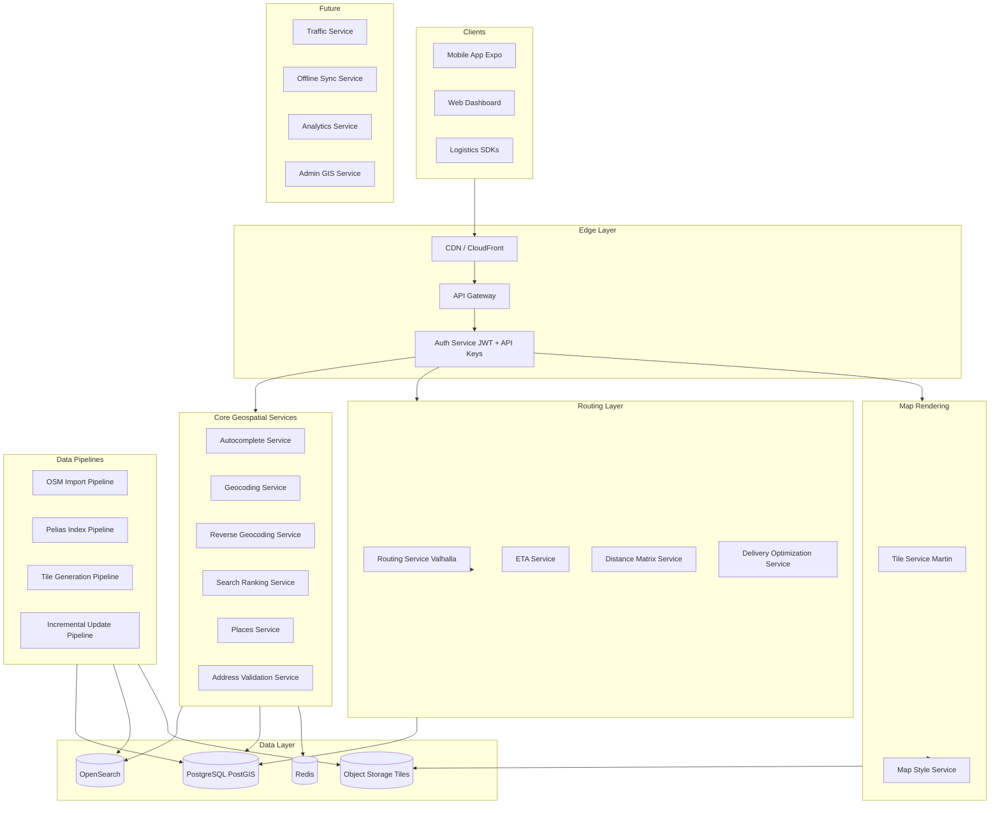

# Flipwi Maps — System Architecture

## 1. Executive summary

Flipwi Maps is a **microservices-based geospatial platform** designed to deliver Google Maps–class functionality (search, autocomplete, geocoding, routing, ETA, places) entirely on **company-owned infrastructure**. The system is optimized for **India-first** deployment with **global expansion** achieved by importing additional regional OSM extracts into the same pipelines—no architectural redesign.

**Base data:** OpenStreetMap (India extract → world extracts)  
**Search:** Pelias + OpenSearch  
**Routing:** Valhalla (primary), OSRM (fallback / matrix)  
**Storage:** PostgreSQL + PostGIS, Redis, OpenSearch, object storage for vector tiles  
**Rendering:** MapLibre GL + self-hosted vector tiles (Martin / TileServer GL)  
**Clients:** Mobile (Expo), web, logistics SDKs — all via API Gateway

---

## 2. Design principles

| Principle | Implementation |
|-----------|----------------|
| No public map APIs in production | All geocoding, routing, tiles served internally |
| India today, world tomorrow | Region-agnostic schemas; `region_code` partitioning |
| Independent deployability | One service = one container = one K8s deployment |
| Observable by default | Prometheus metrics, structured logs, health checks |
| Accuracy over shortcuts | Full OSM import + Pelias place graph + Valhalla graph |
| API-first | Mobile app is a thin client; business logic on platform |

---

## 3. High-level architecture



---

## 4. Microservices catalog

| Service | Responsibility | Primary datastore | Target latency |
|---------|----------------|-------------------|----------------|
| **API Gateway** | Routing, auth, rate limit, request ID | Redis | <10 ms overhead |
| **Tile Service** | Vector/raster tile serving | S3 + Redis cache | <150 ms |
| **Geocoding Service** | Forward geocode, structured search | OpenSearch (Pelias) | <100 ms |
| **Reverse Geocoding Service** | Coordinates → address components | PostGIS + Pelias | <100 ms |
| **Autocomplete Service** | Prefix suggestions, instant typeahead | OpenSearch | <50 ms |
| **Search Ranking Service** | Re-rank by distance, importance, population | Redis + OS | <20 ms |
| **Routing Service** | Multi-modal routes, alternatives | Valhalla | <300 ms |
| **ETA Service** | Time predictions, traffic-ready | Valhalla + Redis | <100 ms |
| **Places Service** | POI details, categories, hours | PostGIS | <100 ms |
| **Address Validation Service** | Normalize, validate, confidence score | PostGIS + Pelias | <150 ms |
| **Map Style Service** | Light/dark/nav/satellite-ready styles | S3 | <50 ms |
| **Analytics Service** | Usage, heatmaps, fleet metrics | ClickHouse/Timescale | async |
| **Offline Sync Service** | Region packs, delta sync | S3 + PostgreSQL | async |
| **Admin GIS Service** | Data QA, manual overrides, versioning | PostgreSQL | internal |
| **Traffic Service** *(future)* | Congestion, closures | Kafka + Redis | <200 ms |

---

## 5. Data architecture

### 5.1 OpenStreetMap ingestion

```
Geofabrik india-latest.osm.pbf
        │
        ├──► osm2pgsql ──► PostgreSQL/PostGIS (raw OSM + admin boundaries)
        ├──► Pelias import ──► OpenSearch (searchable features)
        ├──► Valhalla build ──► routing tiles (valhalla_tiles.tar)
        └──► planetiler / openmaptiles ──► vector MBTiles ──► S3
```

**Versioning:** Each import tagged `dataset_version` (e.g. `india-2026-07-07`).  
**Incremental updates:** OsmChange files applied daily; Pelias partial reindex; Valhalla tile rebuild (scheduled).

### 5.2 Searchable feature coverage

Pelias indexes **every searchable OSM feature** including:

- Administrative: country, state, district, city, town, village, hamlet, panchayat, mandal, taluk, block
- Addressable: colony, layout, locality, neighbourhood, road, highway, building, apartment
- POI: schools, hospitals, banks, shops, fuel, EV charging, transit stops, airports, temples, etc.

Custom importers extend Pelias for India-specific admin labels (gram panchayat, mandal, tehsil).

### 5.3 World expansion

Add `region_code` column everywhere (`IN`, `US`, `EU`, …). Import additional PBF files into same pipelines. API accepts `region` parameter; gateway routes to correct index shard. **No service code changes** — only data ops.

---

## 6. Search quality engine

### 6.1 Pelias + custom ranking layer

1. **Autocomplete Service** — prefix query to OpenSearch (`edge_ngram`, `completion` suggester)
2. **Geocoding Service** — full-text + structured query
3. **Search Ranking Service** — post-process:
   - Population weight (`geonames` population field)
   - OSM importance (`place` rank, `admin_level`)
   - Distance decay from `focus.point.lat/lon`
   - Fuzzy match (Levenshtein, phonetic for Indic transliteration)
   - Alias / alternate name boost (`name:hi`, `name:en`, `alt_name`)

### 6.2 Supported query types

| Type | Example |
|------|---------|
| Prefix | `koram` → Koramangala |
| Fuzzy | `banglore` → Bangalore |
| Partial | `mg rd` → MG Road |
| Abbreviation | `blr` → Bengaluru |
| Nearby | Results biased to GPS |
| Native | `बेंगलुरु` + English |

---

## 7. Routing & logistics

### 7.1 Valhalla configuration

| Costing model | Use case |
|---------------|----------|
| `auto` | Driving, cars |
| `motorcycle` | Two-wheeler |
| `truck` | Heavy vehicle, height/weight |
| `bicycle` | Cycling |
| `pedestrian` | Walking |
| `auto` + `use_tolls=0` | Avoid toll |
| `auto` + `use_ferry=0` | Avoid ferry |

### 7.2 Delivery optimization

- **Multi-stop** — Valhalla `optimized_route` / OR-Tools overlay
- **Distance matrix** — Valhalla `sources_to_targets`
- **Nearest driver** — PostGIS `ST_DWithin` + matrix ETA
- **Pickup/drop** — standard `/route` with waypoint sequence

---

## 8. Map rendering

| Theme | Style ID | Use |
|-------|----------|-----|
| Light | `streets-light` | Default |
| Dark | `streets-dark` | Night mode |
| Navigation | `navigation-day` | Turn-by-turn |
| Satellite-ready | `satellite-hybrid` | Aerial + labels |

**Stack:** Planetiler → MBTiles → Martin tile server → MapLibre GL (mobile WebView).

---

## 9. Performance & caching

| Layer | Strategy |
|-------|----------|
| Autocomplete | Redis cache keyed by `prefix+region+lat+lon` TTL 60s |
| Geocode | Redis TTL 300s; CDN for static place details |
| Reverse | H3 cell cache (resolution 10) TTL 600s |
| Routing | Cache identical origin/dest/mode TTL 120s |
| Tiles | CDN edge cache; immutable tile URLs with version |

See [PERFORMANCE-SLA.md](./PERFORMANCE-SLA.md).

---

## 10. Security

- **JWT** — user sessions (fleet apps, admin)
- **API keys** — B2B client integrations (`X-API-Key`)
- **Rate limiting** — per key, per IP (Redis token bucket)
- **Audit logs** — all write operations + admin actions
- **mTLS** — service-to-service in Kubernetes

See [SECURITY.md](./SECURITY.md).

---

## 11. Repository layout

```
platform/
├── docs/                    # Architecture, API, deployment
├── infrastructure/
│   ├── docker-compose.yml   # Local full stack
│   └── kubernetes/          # Production manifests
├── services/                # Microservice source (one folder each)
├── pipelines/               # OSM import, index, tile jobs
└── schemas/                 # SQL migrations
```

Mobile client remains at repository root (`App.tsx`, `components/`, `lib/`).

---

## 12. Implementation phases

| Phase | Duration | Deliverable |
|-------|----------|-------------|
| **P0** | Weeks 1–2 | Docker Compose, PostGIS, OpenSearch, API Gateway |
| **P1** | Weeks 3–6 | India OSM import, Pelias index, autocomplete + geocode |
| **P2** | Weeks 7–10 | Valhalla routing, ETA, distance matrix |
| **P3** | Weeks 11–14 | Vector tiles, map styles, mobile integration |
| **P4** | Weeks 15–18 | Address validation, delivery optimization |
| **P5** | Weeks 19–24 | K8s production, monitoring, incremental updates |
| **P6** | Future | Traffic, offline sync, analytics |

---

## 13. Technology stack

| Component | Technology |
|-----------|------------|
| API Gateway | Kong / Traefik / custom Node (current `server/`) |
| Search | Pelias 1.x + OpenSearch 2.x |
| Database | PostgreSQL 16 + PostGIS 3.4 |
| Cache | Redis 7 |
| Routing | Valhalla 3.x |
| Tiles | Planetiler + Martin |
| Orchestration | Kubernetes (EKS/GKE/AKS) |
| CI/CD | GitHub Actions |
| Monitoring | Prometheus + Grafana + Loki |
| Object storage | S3-compatible (MinIO dev, AWS S3 prod) |

---

## 14. Final objective

A **production-ready platform** providing Google Maps–level search, geocoding, routing, autocomplete, and delivery APIs using **open-source technologies on our infrastructure** — supporting nearly every searchable place in India with high accuracy, low latency, and enterprise scalability, ready for worldwide expansion by data import alone.
